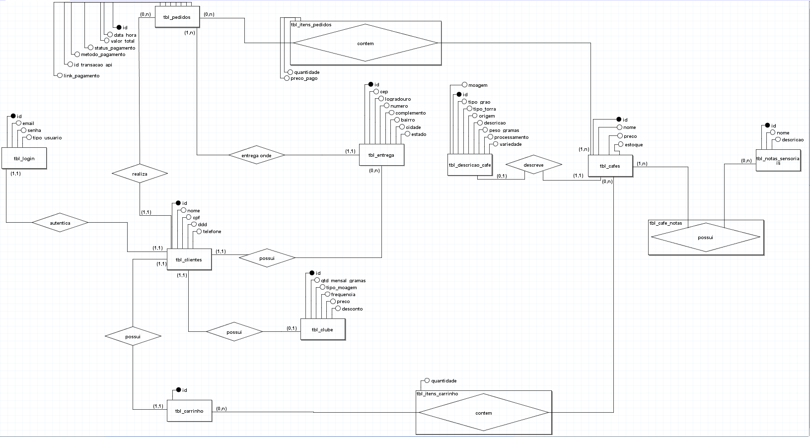
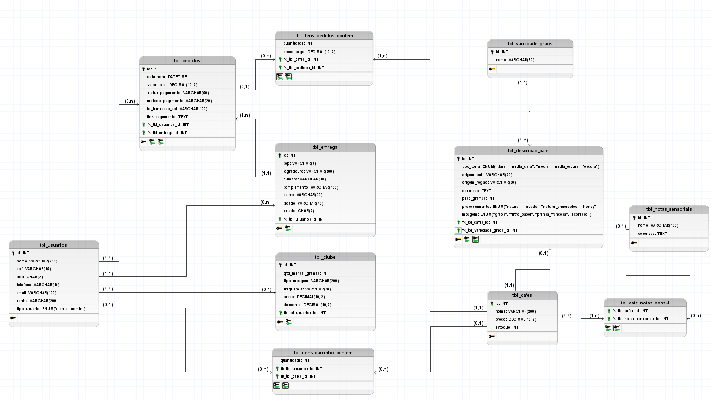

  [](https://www.linkedin.com/in/raphael-cortes-b0b544305/) [](https://www.instagram.com/raphaelcorte_s/) [](https://wa.me/5561998294492)
# ☕ E-Commerce Café - Arquitetura de Banco de Dados

Este repositório contém a arquitetura completa de banco de dados para um e-commerce fictício de cafés especiais. O ecossistema abrange desde o levantamento de requisitos e modelagem conceitual até a criação de scripts DDL, carga de dados (DML) e consultas analíticas de auditoria (DQL).

> 🌐 **Acesse o site utilizado na abstração do projeto:** [Clique aqui para visualizar o E-Commerce](https://gemini.google.com/share/2f7cd1c25622)

---

## 📌 Contexto e Motivação
Este projeto foi desenvolvido como parte de um desafio prático do curso de **Administração de Banco de Dados no SENAI**. 

A proposta consistiu em projetar o banco de dados para dar suporte a um e-commerce de cafés cujo front-end/estrutura foi idealizado e gerado com o auxílio de Inteligência Artificial. O objetivo principal deste repositório é demonstrar a capacidade de abstrair um contexto muito parecido com o real e traduzi-lo regras de negócio complexas em uma estrutura de dados relacional otimizada, íntegra e performática.

---

## 📐 Modelagem do Banco de Dados

### Conceitual
O desenho abaixo representa o ecossistema e as entidades do negócio, mapeando o fluxo desde o cadastro de usuários (clientes/admins) até o fechamento de pedidos e assinaturas de clubes.



### Lógica
Com a modelagem lógica é possível visualizar como as relações definidas na modelagem conceitual se traduzem nas chaves estrangeiras (FK) dentro das tabelas.


### Regras de Negócio Implementadas
* **Relacionamento 1:1 Restrito:** Aplicado entre o Café e sua Descrição Técnica, garantindo isolamento de dados pesados de texto.
* **Assinatura VIP:** Relação exclusiva de 1:1 entre Usuários e o Clube de Assinatura.
* **Integridade Referencial (Cascading):** Configuração fina de regras `ON DELETE CASCADE` para carrinhos temporários e endereços, e `ON DELETE RESTRICT` em tabelas de histórico de pedidos para proteção contábil (Auditoria).
* **Otimização de Tipagem:** Uso estrito de `CHAR(11)` para CPF sem formatação, visando ganho de performance em indexação e buscas na memória RAM.

---

## 🛠️ Tecnologias utilizadas
* **SGBD:** MySQL (Versão 8.0+)
* **Modelagem:** brModelo (Conceitual e Lógico)
* **Documentação:** Microsoft Excel (Dicionário de Dados padronizado)
* **Linguagem:** SQL (Structured Query Language)

---

## 🗂️ Estrutura do Repositório

```text
├───img
│       conceitual_ecomm_cafe.png
│       logico_ecomm_cafe.png
│
├───modelagem
│       conceitual_desafiocafe.brM3
│       dicionario_dados_ecommerce_cafe.xlsx
│       Lógico_desafiocafe.brM3
│
├───scripts_sql
│        ddl_cafe.sql
│        dml_cafe.sql
│        dql_cafe.sql
└── README.md
```

---

## 📊 Destaques dos Cenários de Teste (DQL)
Os scripts de consulta (`dql_cafe.sql`) simulam situações reais de um e-commerce em produção, incluindo:

* **Recuperação de Carrinhos Abandonados:** Cruzamento de tabelas associativas N:M para identificar clientes com intenção de compra pendente.
* **Roda de Sabores (Mapeamento de Notas):** Consultas em cadeia para associar múltiplos perfis sensoriais a microlotes de café.
* **Auditoria Contábil:** Criação de queries avançadas com agrupamentos (`GROUP BY`), funções agregadas (`SUM`) e condicionais (`CASE WHEN`) para validar se a soma dos itens de um pedido bate exatamente com o valor total registrado na tabela pai, garantindo a consistência financeira do banco.

---

## 🚀 TODO
O projeto foi estruturado pensando em escalabilidade. As próximas fases de desenvolvimento incluem a inteligência e automação do e-commerce:

- [ ] **Integração de um Chatbot de Atendimento:** Implementação de um assistente virtual inteligente integrado aos canais de comunicação do e-commerce.
- [ ] **Arquitetura RAG (Retrieval-Augmented Generation):** Conectar uma LLM (Large Language Model) diretamente a uma base de conhecimento do negócio (dados de produtos, políticas de troca, dúvidas frequentes) para garantir respostas rápidas, precisas e contextuais.
- [ ] **Integração com o Banco de Dados:** Permitir que o chatbot consulte tabelas específicas do MySQL em tempo real (como disponibilidade de estoque e status de pedidos) para agilizar o suporte ao cliente sem intervenção humana.

---

---

## 👤 Autor
* **Raphael Cortes** - [LinkedIn](https://www.linkedin.com/in/raphael-cortes-b0b544305/) | [Instagram](https://www.instagram.com/raphaelcorte_s/) | [WhatsApp](https://wa.me/5561998294492)